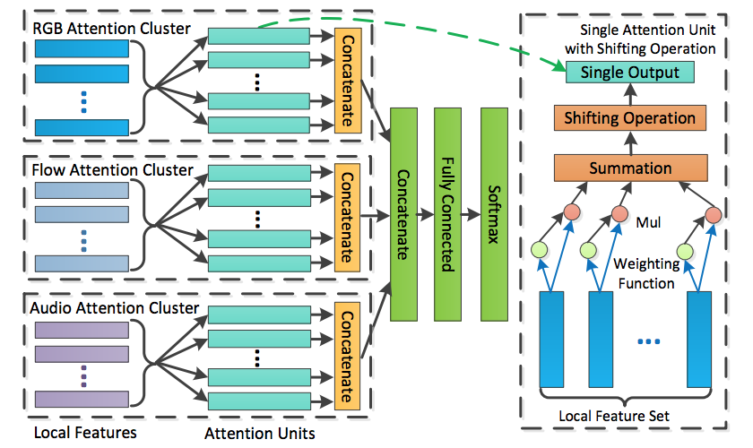
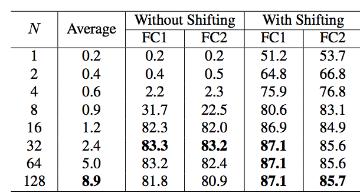

# AttentionCluster
This code implements attention clusters with shifting operation. It was developed on top of starters code provided by Google AI. Detailed table of contents and descriptions can be found at the [original repository](https://github.com/google/youtube-8m).



The module was implemented & tested in TensorFlow 1.8.0. Attention Cluster is distributed under Apache-2 License (see the `LICENCE` file). 

# Differences with the original paper
- The respository makes use of youtube-8m dataset. The original paper uses Flash-MNIST. 
- Empirically, I found that batch normalization layer at attention mechanism increases the convergence time & GAP.
- In between MoE, I used wide context gating developed from [2]. 
- Dropout layers were actively used to prevent overfitting. This was inspired by [3].

# Training
Training dataset is available in Google Cloud Platform. In order to use the following command, first download GCP SDK. It is recommanded to adopt early stopping.
```
gcloud ml-engine local train --package-path=youtube-8m --module-name=youtube-8m.train -- --train_data_pattern='gs://youtube8m-ml-us-east1/2/frame/train/train*.tfrecord' --frame_features=True --base_learning_rate=0.0002 --model=AttentionClusterModule --feature_names='rgb,audio' --feature_sizes='1024,128' --batch_size=128 --train_dir=AttentionClusterModule --base_learning_rate=0.0002 --runtime-version=1.8 --video_cluster_size=128 --audio_cluster_size=16 --shift_operation=True --filter_size=2 --cluster_dropout=0.7 --ff_dropout=0.8 --hidden_size=512 --moe_num_mixtures=2 --learning_rate_decay_examples=2000000 --learning_rate_decay=0.85 --num_epochs=4 --moe_l2=1e-6 --max_step=400000 
```
# Evaluation
Validation / Test dataset is also available in Google Cloud Platform. With this parameter settings, I was able to acheive **86.8 GAP** on test data.
```
gcloud ml-engine local train --package-path=youtube-8m --module-name=youtube-8m.eval -- --eval_data_pattern='gs://youtube8m-ml-us-east1/2/frame/validate/validate*.tfrecord' --frame_features=True --model=AttentionClusterModule --feature_names='rgb,audio' --feature_sizes='1024,128' --batch_size=128 --train_dir=AttentionClusterModule --base_learning_rate=0.0002 --run_once=True --video_cluster_size=128 --audio_cluster_size=16 --shift_operation=True --filter_size=2 --cluster_dropout=0.7 --ff_dropout=0.8 --hidden_size=512 --moe_num_mixtures=2 --learning_rate_decay_examples=2000000 --learning_rate_decay=0.85 --num_epochs=4 --moe_l2=1e-6 --max_step=400000 
```


# References
Please note that I am **not** the author of the following references.

[1] https://arxiv.org/abs/1711.09550  
[2] https://arxiv.org/abs/1706.06905  
[3] https://arxiv.org/abs/1706.03762  

# Changes
- **1.00** (05 August 2018)
    - Initial public release
    
# Contributors
- [Juhan Bae](https://github.com/pomonam)
